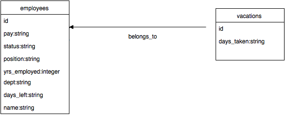

#HR Pro
##Description
This project consisted of a team of four people collaborating together to design, create, and build a working application. This program allows users to enter personal data and retrieve information regarding their employment as it pertains to them. To visit the HR Pro application, go <a href="https://secure-fjord-5088.herokuapp.com">here</a>.
##Features
- names of employees
- department in which employees work
- years of employees are employed
- position of employee
- work status of employee is either "full-time" or "part-time"
- employee pay is either "hourly" or "salary"?
- vacation days remaining that an employee may utilize
- vacation date taken by a particular employee
##Instructions
###To view employee data individually:
- Send a `GET` request to `https://secure-fjord-5088.herokuapp.com/employees/id`. The response will be in JSON format with the following parameters:

```
      name:         "string"
      days_left:    "string"
      dept:         "string"
      yrs_employed: "integer"
      position:     "string"
      status:       "string"
      pay:          "string"

```

###To view a list of all employees:
- Send a `GET` request to `https://secure-fjord-5088.herokuapp.com/employees`. The response will be in JSON format with the following parameters:

```
      name:         "string"
      days_left:    "string"
      dept:         "string"
      yrs_employed: "integer"
      position:     "string"
      status:       "string"
      pay:          "string"

```

###To view a list of all the employees by work status:
- Send a `GET` request to `https://secure-fjord-5088.herokuapp.com/employees/status/:status`. The response will be in JSON format with the following paramters:

```
      name:         "string"
      days_left:    "string"
      dept:         "string"
      yrs_employed: "integer"
      position:     "string"
      status:       "string"
      pay:          "string"
      days_taken:   "string"

```

###To create a new employee:
- Send a `POST` request to `https://secure-fjord-5088.herokuapp.com/employees`. The response will be in JSON format with the following parameters:

```
      name:         "string"
      days_left:    "string"
      dept:         "string"
      yrs_employed: "integer"
      position:     "string"
      status:       "string"
      pay:          "string"

```

###To update an employee record:
- Send a `PUT` request to `https://secure-fjord-5088.herokuapp.com/employees`. The response will be in JSON format with the following parameters:

```
      name:         "string"
      days_left:    "string"
      dept:         "string"
      yrs_employed: "integer"
      position:     "string"
      status:       "string"
      pay:          "string"

```

###To delete an employee record:
- Send a `DELETE` request to `https://secure-fjord-5088.herokuapp.com/employees/id`. The response will be: "Employee terminated and record deleted successfully."

```
      name:         "string"
      days_left:    "string"
      dept:         "string"
      yrs_employed: "integer"
      position:     "string"
      status:       "string"
      pay:          "string"

```

###To view a list of all of the vacation days taken by a particular employee:
- Send a `GET` request to `https://secure-fjord-5088.herokuapp.com/employees/id/vacations`. The response will be in JSON format with the following parameters:

```
      name:         "string"
      days_left:    "string"
      dept:         "string"
      yrs_employed: "integer"
      position:     "string"
      status:       "string"
      pay:          "string"
      days_taken:   "string"

```

###To view a list of all of the employees and their corresponding number of days remaining for vacation:
- Send a `GET` request to `https://secure-fjord-5088.herokuapp.com/employees/days_left/:days_left`. The response will be in JSON format with the following parameters:

```
      name:         "string"
      days_left:    "string"
      dept:         "string"
      yrs_employed: "integer"
      position:     "string"
      status:       "string"
      pay:          "string"
      days_taken:   "string"

```
##Tables

