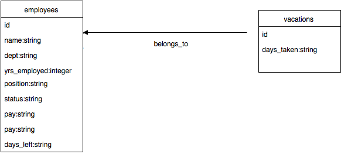

#HR PRO
##Description
 This program is intended for management-level users to access personal data and retrieve information regarding employment data as it pertains to employees. To visit the HR PRO application, go <a href="https://secure-fjord-5088.herokuapp.com">here</a>.
##Application features:
- The ability to list all employees, both collectively and individulally
- The ability to create, update, and delete records with respect to work status & vacation days.

###Employee and vacation features:

      -names of employees
      -department in which employees work
      -years employees are employed
      -position of employee
      -work status of employee is either "full-time" or "part-time"
      -employee pay is either "hourly" or "salary"
      -vacation days remaining that an employee may utilize
      -vacation date taken by a particular employee

##Instructions
###To view a list of all employees:
- Send a `GET` request to `https://secure-fjord-5088.herokuapp.com/employees`. The response will be in JSON format with the following parameters:

```
      name:         "string"
      dept:         "string"
      yrs_employed: "integer"
      position:     "string"
      status:       "string"
      pay:          "string"
      days_left:    "string"

```

###To view employee data individually:
- Send a `GET` request to `https://secure-fjord-5088.herokuapp.com/employees/:id`. The response will be in JSON format with the following parameters:

```
      name:         "string"
      dept:         "string"
      yrs_employed: "integer"
      position:     "string"
      status:       "string"
      pay:          "string"
      days_left:    "string"

```

###To view a list of all the employees by work status:
- Send a `GET` request to `https://secure-fjord-5088.herokuapp.com/employees/status/:status`. The response will be in JSON format with the following paramters:

```
      name:         "string"
      dept:         "string"
      yrs_employed: "integer"
      position:     "string"
      status:       "string"
      pay:          "string"
      days_left:    "string"

```

###To create a new employee record:
- Send a `POST` request to `https://secure-fjord-5088.herokuapp.com/employees`. The response will be in JSON format with the following parameters:

```
      name:         "string"
      dept:         "string"
      yrs_employed: "integer"
      position:     "string"
      status:       "string"
      pay:          "string"
      days_left:    "string"

```

###To update an employee record:
- Send a `PUT` request to `https://secure-fjord-5088.herokuapp.com/employees/:id`. The response will be in JSON format with the following parameters:

```
      name:         "string"
      dept:         "string"
      yrs_employed: "integer"
      position:     "string"
      status:       "string"
      pay:          "string"
      days_left:    "string"

```

###To delete an employee record:
- Send a `DELETE` request to `https://secure-fjord-5088.herokuapp.com/employees/:id`. The response will be:

```
{ message: "Employee terminated and record deleted successfully." } with a status of 200

Once the employee is deleted, if a `DELETE` request is sent again on the same id, the message rendered is:

{ error_msg: "No valid employee found.", id: params[:id] } with a status of 404

```

###To view a list of day taken by and their corresponding number of days remaining for vacation:
- Send a `GET` request to `https://secure-fjord-5088.herokuapp.com/employees/days_left/:days_left`. The response will be in JSON format with the following parameters:

```
      name:         "string"
      dept:         "string"
      yrs_employed: "integer"
      position:     "string"
      status:       "string"
      pay:          "string"
      days_left:    "string"
      days_taken:   "string"

```

###To view a list of all of the vacation days taken by a particular employee:
- Send a `GET` request to `https://secure-fjord-5088.herokuapp.com/employees/:id/:days_left`. The response will be in JSON format with the following parameter:

```
      date_taken:  "string"

```

<!-- ###To create a new vacation date taken:
- Send a `POST` request to `https://secure-fjord-5088.herokuapp.com/employees/:id/:days_taken`. The response will be in JSON format with the following parameters:


```
      days_taken:   "string"

``` -->

##Tables

